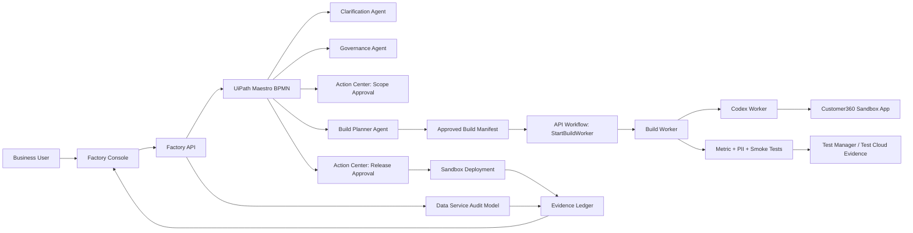

# Devpost Submission Draft

Use this as the copy-paste source for the UiPath AgentHack submission. Replace
placeholder links before final submission.

## Project Title

Governed Agentic Automation Factory

## Tagline

UiPath as the enterprise control plane for coding agents that build governed internal business apps.

## Elevator Pitch

```text
Agent Factory turns business app requests into UiPath-governed coding-agent builds: clarification, approvals, manifest, tests, sandbox preview, and audit evidence.
```

## Track

```text
Track 2: UiPath Maestro BPMN
```

## Project Story

```markdown
# Governed Agentic Automation Factory

**UiPath as the enterprise control plane for coding agents that build governed internal business apps.**

## Inspiration

AI has made it dramatically easier to produce software. That is exciting, but inside an enterprise it creates a new kind of waste: not just time wasted building the wrong thing, but trust wasted every time an internal app appears without an owner, approved data scope, test evidence, audit history, or release decision.

The numbers show the tension. Stack Overflow's 2025 Developer Survey found that 84% of developers use or plan to use AI tools, while 46% distrust the accuracy of AI output. That is the gap I wanted to build for. Enterprises do not need another way to generate code in isolation. They need a way to govern what coding agents build.

Agent Factory is my answer: a governed request-to-release factory where a business user can ask for an internal app, AI can help plan and build it, and UiPath owns the lifecycle around it: orchestration, approvals, policy, test evidence, sandbox deployment, and audit.

## What It Does

Agent Factory turns a business request into a governed coding-agent build. In the demo flow, the request is a Customer360 analytics dashboard for revenue operations and customer success leaders, but the product pattern is broader: any internal app request should move through a controlled enterprise lifecycle before a coding agent touches the repository.

The core workflow:

1. **A business user submits an intent.** The user describes the outcome they want, the audience, the deadline, and the business context.
2. **The system analyzes missing information.** The clarification agent identifies what is not safe to assume: source systems, table/schema details, metric definitions, filters, PII policy, refresh expectations, and approval ownership.
3. **The request becomes structured enterprise work.** Requirements, governance, and build-planning agents turn a messy ask into an approved scope, risk posture, data policy, and build plan.
4. **Guardrails become executable.** The build manifest defines approved metrics, allowed files, forbidden actions, sandbox-only deployment, PII masking, output targets, and repair limits.
5. **Humans remain in the loop.** Scope approval happens before the worker path proceeds, and release approval happens after build and quality evidence are available.
6. **The coding agent works inside a contract.** Codex receives a constrained manifest instead of a vague prompt, then returns branch/session, changed-file, test, and artifact evidence.
7. **Quality gates protect the release.** Metric tests, PII masking tests, build checks, smoke checks, and Test Manager/Test Cloud evidence shape the release decision.
8. **The result is a sandbox app, not an unchecked production push.** The Customer360 dashboard renders masked synthetic data, refresh states, degraded and empty states, segment filters, governed KPIs, and audit linkage.
9. **The evidence ledger makes the work ownable.** The manifest, audit timeline, platform events, API state, test status, approvals, and worker contract are visible to judges and operators.

The output is not just a dashboard. The dashboard proves that the system can produce an internal app. The evidence proves the enterprise can own it.

## How We Built It

I built Agent Factory as a TypeScript monorepo with a UiPath-shaped orchestration layer around a coding-agent worker.

### Product architecture

| Layer | What it does | Why it matters |
| --- | --- | --- |
| **Factory Console** | Operator-facing UI for intake, clarification, build plan, approvals, live run, preview, and evidence | Makes the governance lifecycle visible and usable, not hidden in logs |
| **Factory API** | Lifecycle API for requests, clarification, spec, governance, approval, manifest, build queue, deployment evidence, and audit timeline | Gives the product a stateful control plane that UiPath callbacks can update |
| **Maestro BPMN** | Request-to-release process spine for intake, agent work, human gates, API handoffs, quality, release, deployment, and audit | Maps directly to the hackathon's Maestro BPMN track and turns the app factory into a real business process |
| **UiPath Agents** | Requirements, Clarification, Governance, Build Planner, and Test Summary agents | Keeps AI work role-specific, reviewable, and connected to the process |
| **Action Center** | Scope/data approval and release approval gates | Keeps accountable humans in the workflow at the moments that matter |
| **API Workflows** | StartBuildWorker, FetchBuildStatus, PostStatusUpdate, RecordTestResult, StartDeployment, and RecordUiPathEvent | Bridges UiPath orchestration to the build worker, tests, deployment, and evidence callbacks |
| **Data Service model** | Request, manifest, approval, test, deployment, and audit schema | Provides the durable enterprise record for what was requested, approved, built, tested, and released |
| **Build Worker** | Validates the manifest, enforces allowed/forbidden actions, invokes the coding-agent path, and records build status | Prevents the coding agent from acting as an unbounded autonomous process |
| **Codex worker contract** | Receives approved manifest, works in a bounded workspace, and returns changed-file, test, branch, session, and artifact evidence | Makes coding agents useful without making them ungoverned |
| **Customer360 template** | Generated sandbox app with masked synthetic customer analytics | Gives judges a concrete app artifact to inspect |
| **Test Manager / Test Cloud evidence** | Quality-gate catalog for PII, metrics, empty/degraded states, build, smoke, and release checks | Converts quality into release evidence instead of a verbal claim |

### UiPath integration

The most important design choice was making UiPath the operating layer, not a logo beside the demo.

- **Maestro BPMN** models the end-to-end lifecycle: request, clarification, governance, scope approval, manifest creation, build worker handoff, test summary, release approval, sandbox deployment, and evidence.
- **UiPath Agents** split reasoning into clear responsibilities: clarify missing facts, derive requirements, assess governance, build the manifest, and summarize test evidence.
- **Action Center** represents the human gates: first for scope/data policy, then for release.
- **API Workflows / Integration Service** provide the handoff surface to the Build Worker, build status polling, test result recording, deployment start, and live platform-event callbacks.
- **Data Service** is modeled as the audit/state system of record for requests, manifests, approvals, tests, deployments, and platform evidence.
- **Orchestrator** provides the Automation Cloud folder context, process visibility, runtime assets, and operational boundary.
- **Test Manager / Test Cloud** provide a quality-gate catalog so release readiness is tied to concrete checks rather than trust in generated code.
- **UiPath for Coding Agents + Codex** supplies the coding-agent lane, but only after UiPath-shaped governance produces the manifest that constrains it.

### Technical implementation

**Frontend:** React, Vite, and TypeScript power the Factory Console and Customer360 sandbox app.

**Backend:** Node/TypeScript services implement the Factory API and Build Worker. Shared contracts keep the UI, API, worker, and UiPath assets aligned.

**AI/runtime:** Fireworks-backed agent profiles power clarification, requirements, governance, and planning when provider credentials are configured. The runtime exposes safe readiness and trace metadata without leaking prompts, secrets, emails, or phone numbers.

**Coding-agent control:** The Build Worker validates a manifest before any worker path runs. The manifest includes approved data sources, approved metrics, output targets, allowed files, forbidden actions, PII policy, sandbox-only deployment, and repair limits.

**Data and privacy:** The Customer360 app uses synthetic data with PII masking. Names are tokenized; emails and phone numbers are suppressed. Tests cover metric correctness, masking, degraded feeds, empty states, and refresh mutation.

**Quality and evidence:** The repository includes lint, typecheck, unit tests, build checks, smoke checks, privacy/security scans, Customer360 metric tests, and UiPath quality-gate assets.

## Challenges We Ran Into

**Making governance feel like product, not paperwork.** The easiest version would have been a chat prompt that generates a dashboard. The harder and more valuable version was a lifecycle where every screen answers an enterprise question: who asked, what data is approved, what policy applies, who approved it, what was built, what passed, and what can be released.

**Turning a prompt into a safe worker contract.** A coding agent is powerful, but a vague request is not a safe build instruction. The build manifest became the core abstraction: it translates business intent and governance policy into an executable contract with allowed files, forbidden actions, output targets, tests, and sandbox boundaries.

**Bridging low-code orchestration and coded agents.** UiPath is strongest when it owns the process, while coded agents are strongest when they handle flexible reasoning and repository work. I designed the system so Maestro, Action Center, API Workflows, Data Service, and Test Manager carry the enterprise process, while the coding agent operates inside that process.

**Preserving evidence even when automation is messy.** Real enterprise automation is not always a straight green path. Agent Factory treats blocked or degraded states as product behavior: the worker can stop honestly, approvals can remain pending, and the evidence timeline still explains what happened.

**Keeping the demo inspectable.** The Customer360 dashboard had to be useful on its own, but also clearly subordinate to the factory around it. That is why the app includes masked data, metric tests, refresh/degraded/empty states, audit linkage, and sandbox-only release evidence.

## Accomplishments I'm Proud Of

- I built an end-to-end governed app factory flow: request -> clarification -> governance -> build plan -> approval -> run -> release -> preview -> evidence.
- I made the UiPath architecture central to the product: Maestro BPMN, UiPath Agents, Action Center, API Workflows, Data Service, Orchestrator, Test Manager/Test Cloud, and UiPath for Coding Agents each have a defined role.
- I created a manifest-first coding-agent pattern that turns enterprise policy into practical build constraints.
- I shipped a working Customer360 sandbox app with masked synthetic data, KPI cards, segment/revenue/retention/risk views, refresh mutation, degraded feed handling, empty state handling, and quality evidence.
- I connected the product story to audit and release control, not just generation speed.
- I built the repo as a real implementation package with source-controlled UiPath assets, shared schemas, test coverage, smoke checks, runbooks, and a reproducible local demo path.

## What I Learned

I learned that the most important question for enterprise AI is not "can the model do the task?" It is "can the organization own the result?"

Coding agents are much more useful when they are not treated as magic. They need a contract: approved scope, data boundaries, allowed files, forbidden actions, tests, and a clear definition of done. Human approval also needs to be part of the product experience, not an afterthought.

I also learned that UiPath is a natural control plane for this problem because it already speaks the enterprise language: processes, humans, approvals, APIs, records, tests, and operations. Agent Factory uses that strength to make coding agents fit enterprise delivery instead of forcing enterprise teams to trust unbounded automation.

## What's Next

The next step is to turn Agent Factory into a reusable internal app factory:

- Expand beyond Customer360 into additional approved app templates: finance close dashboards, support operations consoles, compliance evidence portals, HR workflow tools, and sales operations workbenches.
- Promote the Data Service model into the durable audit store for every request, manifest, approval, test, deployment, and platform event.
- Run Action Center approvals as live enterprise tasks for scope, data, release, and waiver decisions.
- Extend Test Cloud coverage so generated apps automatically receive UI, API, metric, accessibility, and regression gates.
- Add GitHub PR automation so every generated app has a branch, diff, review trail, checks, and rollback plan.
- Add an enterprise template catalog where administrators define what kinds of apps coding agents are allowed to build.
- Make policy reusable: PII handling, source allowlists, deployment environments, repair limits, secret access, and production-release rules should be centrally governed, not reinvented per request.

The long-term vision is simple: enterprises should be able to adopt coding agents without creating a new shadow IT problem. The AI plans and builds. UiPath orchestrates, governs, and records the evidence. Agent Factory is the controlled path from business request to reviewed internal app.

## Safety, Privacy, and Boundaries

Agent Factory is built around a sandbox-first release model. The Customer360 dashboard uses synthetic data, masked identifiers, and no raw PII. The worker contract forbids production deployment, secret access, unapproved external network calls, deleting existing files, and logging raw PII. The product is an enterprise governance and delivery tool; it does not claim to certify security, replace human approval, or release production systems without an accountable decision.
```

## Architecture Diagram For README / Deck

Devpost may not render Mermaid. Use this in the repository README, deck, or as
the source for a static architecture image.



## Architecture Table Short Version

Use this if the project story field feels too long.

```markdown
| Layer | Role |
| --- | --- |
| Maestro BPMN | Request-to-release process spine |
| UiPath Agents | Requirements, clarification, governance, planning, and test summaries |
| Action Center | Scope and release human approval gates |
| API Workflows | Build worker, status, test, deployment, and evidence handoffs |
| Data Service | Audit/state model for requests, manifests, approvals, tests, and deployments |
| Build Worker + Codex | Manifest-constrained coding-agent execution |
| Test Manager/Test Cloud | Quality-gate catalog and release evidence |
| Factory Console | Operator UI for intake, plan, run, preview, and audit |
```

## Built With

```text
UiPath Maestro, UiPath Agents, UiPath Action Center, UiPath Data Service, UiPath API Workflows, UiPath Orchestrator, UiPath Test Manager, UiPath Test Cloud, UiPath for Coding Agents, OpenAI Codex, Fireworks AI, LangSmith, React, Vite, TypeScript, Node.js, Vitest, BPMN, JSON Schema
```

## Judge Reproduction Path

```markdown
1. Watch the demo video.
2. Open the Factory Console at the submitted app URL or run locally with `npm run dev:live`.
3. Submit the Customer360 request.
4. Review generated clarification questions and answered state.
5. Generate the build plan and inspect the manifest/governance details.
6. Approve scope and watch the Live Run lifecycle.
7. Approve release.
8. Open the Customer360 sandbox preview.
9. Inspect the evidence view: manifest, audit timeline, platform evidence, API state, quality evidence, and worker contract.
```

## Demo Video Description

```text
The video shows a business request entering Agent Factory, being clarified by AI, converted into governance and a build manifest, approved by a human gate, routed through a UiPath-shaped lifecycle, released to a sandbox Customer360 dashboard, and closed with evidence that the enterprise can own the generated app.
```

## Submission Links To Fill

- GitHub repository: `TODO`
- Demo video: `TODO`
- Live/local product URL: `TODO`
- Slide deck: `TODO`
- Screenshots: Factory Console New Request, Build Plan manifest, Live Run rail, Output Preview, Customer360 dashboard, evidence/architecture close.

## Hackathon Alignment Map

This section is for submission prep. It does not need to be pasted into the
main Devpost story unless there is room.

| Devpost signal | Agent Factory evidence | Where it appears |
| --- | --- | --- |
| Business impact | Governed internal app delivery; reduces shadow IT, unowned AI code, unsafe data access, and missing release evidence | Inspiration, What It Does, Accomplishments |
| Platform usage | Maestro BPMN, UiPath Agents, Action Center, API Workflows, Data Service model, Orchestrator, Test Manager/Test Cloud, UiPath for Coding Agents | How We Built It, Product Architecture |
| Technical execution | Shared schemas, manifest-first worker, allowed/forbidden actions, sandbox-only release, PII masking, tests, audit timeline, evidence callbacks | What It Does, Technical implementation |
| Completeness | Request to clarification to governance to approval to run to preview to evidence | What It Does, Judge Reproduction |
| Creativity and innovation | UiPath as the operating system for coding agents, not a side integration | Inspiration, What I Learned, What's Next |
| Presentation | Five-minute product demo, closing architecture slide, visible dashboard and evidence | Demo Video Description |
| Coding Agents bonus | Codex worker contract constrained by UiPath-approved manifest | What It Does, How We Built It |

## Short Answers

### What did you build?

```text
I built a governed app factory where UiPath orchestrates coding agents from business request to sandbox release. The product turns a Customer360 ask into clarifications, approvals, a build manifest, Codex worker evidence, tests, preview, and audit.
```

### What makes it technically interesting?

```text
The key abstraction is the build manifest. Instead of giving a coding agent an open-ended prompt, Agent Factory gives it approved metrics, source boundaries, allowed files, forbidden actions, PII rules, tests, and release constraints generated through a UiPath-governed lifecycle.
```

### Why UiPath?

```text
UiPath is the control plane: Maestro models the process, agents shape requirements and policy, Action Center gates decisions, API Workflows handle handoffs, Data Service carries state, and Test Manager/Test Cloud provide release evidence.
```

## Final Copy Check

- Main story leads with the enterprise pain before implementation details.
- Track 2 is explicit.
- UiPath platform usage is named in product context, not as a tag dump.
- Codex/coding-agent bonus is visible through the manifest-constrained worker.
- The Customer360 dashboard is framed as the proof artifact; the governed factory is framed as the product.
- Safety/privacy boundaries are present without weakening the main pitch.
